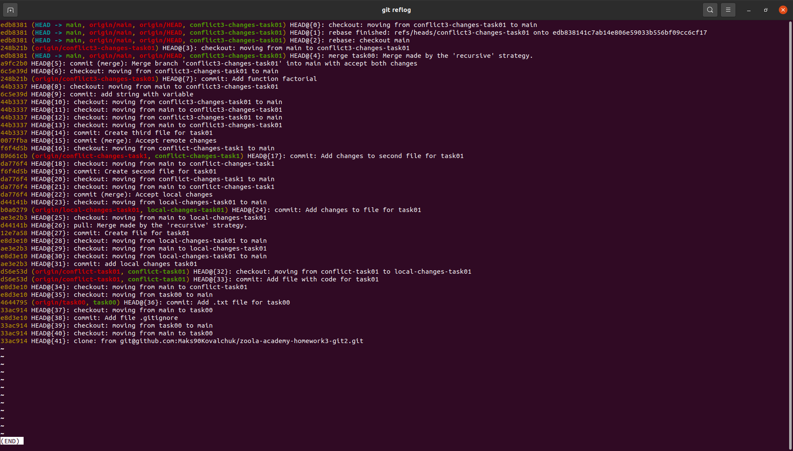

# Task 2: Merge vs Rebase

## git merge

The easiest way to merge the main branch into a feature branch is with the following command:

`git checkout -b feature`
`git merge main`

This operation creates a new "merge commit" on the feature branch, linking the histories of both branches:

## git rebase

Instead of merging, we can rebase the feature branch onto the main branch with the following commands:

`git checkout feature`
`git rebase main`

As a result, the entire feature branch will be on top of the main main branch, including all new commits in the main branch. If rebase is used instead of the merge command for commits, this command rewrites the history of the project, creating new commits for each commit in the source branch

## Conclusion

`git rebase` command solves the same problem as the `git merge` command. Both commands are designed to incorporate changes from one branch into another, but do so in different ways.

## Q&A

Q: Which command did you like the most?

A: Considering the time I have been studying, I am not yet so familiar with the git commands, and therefore I cannot give an unambiguous answer to this question ... BUT - the `git merge` command seems to me simpler and more usable :)

Q: In which cases it is better to use `git merge` and when `git rebase`?

A: Now that you understand the possibilities of rebase, the first thing you need to understand is when you shouldn't use this command. The golden rule for `git rebase` is to never use it on public branches. We use `git merge` when we want non-destructive merges, and use `git rebase` when we wont clear project history. First, this command eliminates unnecessary merge commits required for `git merge`. Secondly, as shown in the picture above, the rebase command creates a perfect linear history of the project - you will be able to trace the functionality to the very beginning of the project without any forks.
